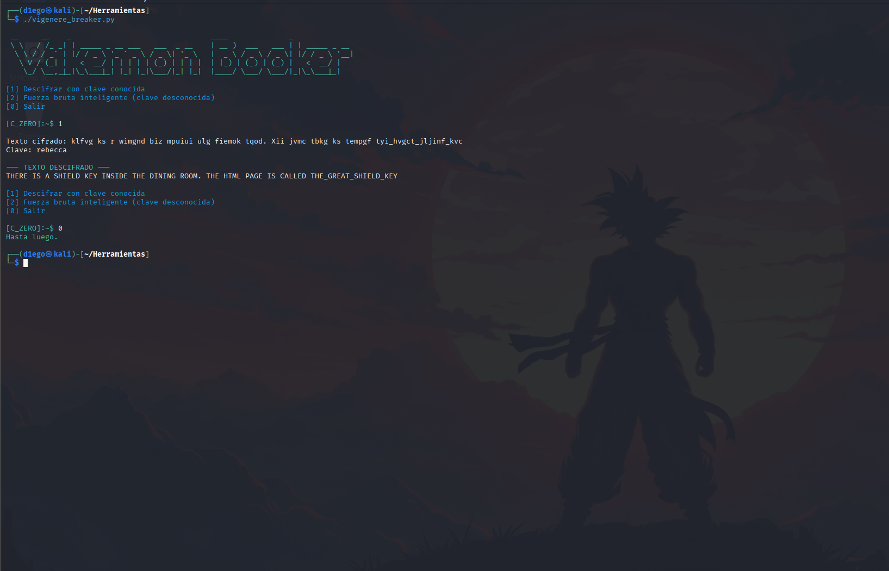
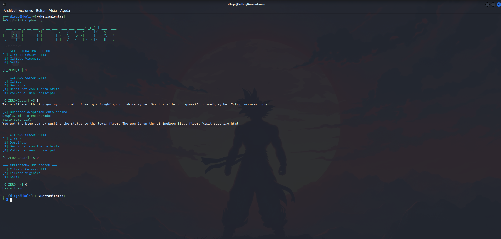
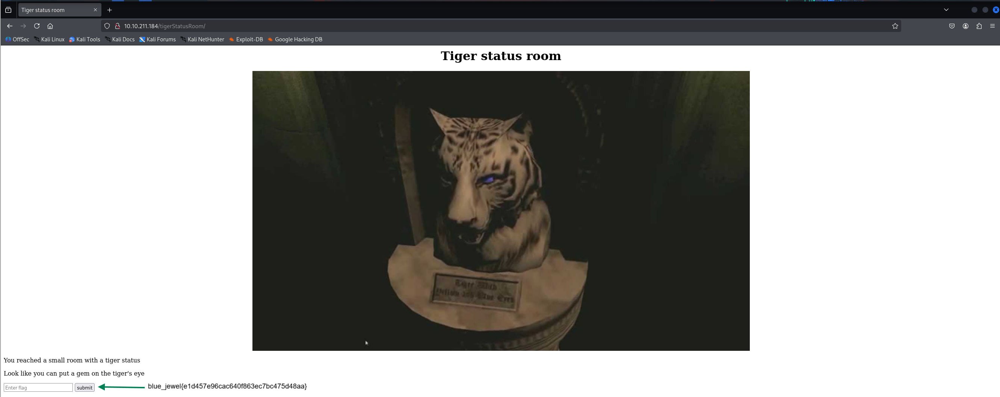
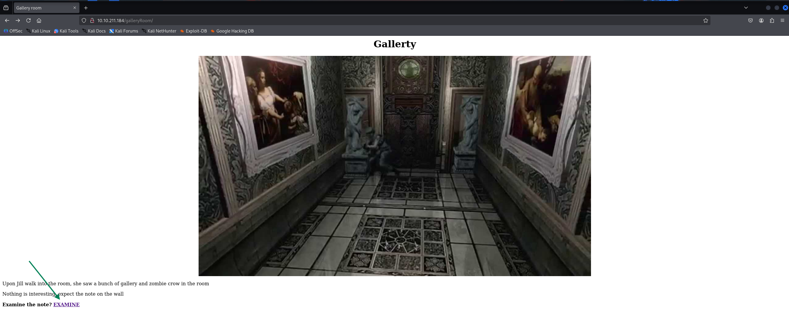
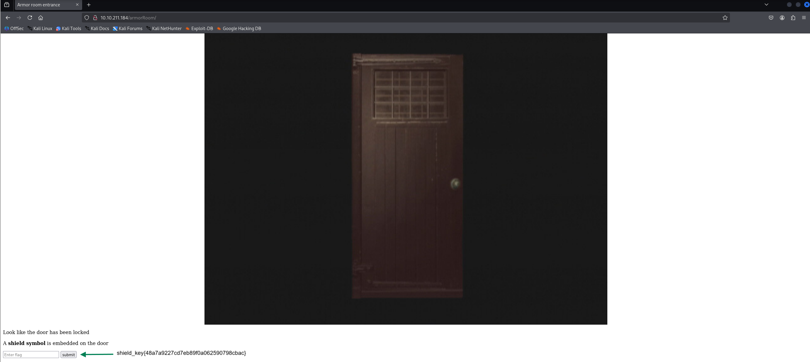

# Writeup: Biohazard

**Biohazard** es una máquina de nivel **Medio** en la plataforma **TryHackMe**, que me brindó un excelente desafío de CTF. En este write-up, documento el proceso que seguí para resolver la máquina, enfrentándome a una serie de retos inesperados que requirieron un profundo **análisis de cifrados** y la aplicación de técnicas de **esteganografía** y **decodificación de textos**. A lo largo de este análisis, detallaré cada paso, desde la fase inicial de reconocimiento hasta la obtención del acceso final.

---

## 📊 Datos Esenciales

- **IP de la Máquina:** `10.10.X.X`
- **Sistema Operativo:** `Linux`
- **Temática:** `Survival Horror`
- **Habilidades Clave:** `Análisis de Cifrados`, `Esteganografía`, `Vigenère`
- **Tiempo de Resolución:** `75 min`
---

## 🕵️‍♂️ Fase 1: Reconocimiento y Enumeración

El primer paso fue realizar un escaneo de puertos para identificar los servicios activos en la máquina. Utilicé `nmap` con los siguientes parámetros para un escaneo de versiones y scripts:

```bash
nmap -p- --open -sS -sC -sV --min-rate 2000 -vvv -n -Pn 10.10.248.135 -oN escaneo
```

El escaneo inicial con **Nmap** confirmó que la máquina está en línea y reveló los siguientes puertos abiertos:

---

### Puertos Abiertos

  * **Puerto 21 (FTP)**
      * **Servicio:** vsftpd 3.0.3
  * **Puerto 22 (SSH)**
      * **Servicio:** OpenSSH 7.6p1 Ubuntu
  * **Puerto 80 (HTTP)**
      * **Servicio:** Apache httpd 2.4.29 (Ubuntu)
      * **Título del sitio:** "Beginning of the end"

---
### Análisis del Sitio Web (Puerto 80)


Dentro del código fuente de http://10.10.248.135/mansionmain/ encontramos el siguiente directorio


Encontramos nuestra primera flag `emblem{fec832623ea498e20bf4fe1821d58727}`

Volvemos a http://10.10.248.135/diningRoom/ e inspecionamos su codigo fuente


Obtenemos una cadena codificada en base64 y para decodificarlo ejectuamos el comando:
```
echo "SG93IGFib3V0IHRoZSAvdGVhUm9vbS8=" | base64 -d
```
 El cual nos revela un nuevo directorio `/teaRoom/`

 
¡
Vemos reflejado otro nuevo directorio, además, al hacer click en `Lockpick` encontramos la bandera: `lock_pick{037b35e2ff90916a9abf99129c8e1837}`

 

 Al hacer click en yes, nos dirige a una página la cual nos revela una multitud de nuevos direcorios a inspecionar

 

 Nos vamos a `/barRoom/` a seguir con la enumeración.
 
 
  
   
   Obtenemos una cadena codificada en base 32 y para decodificarlo ejectuamos el comando:
   ```
   echo "NV2XG2LDL5ZWQZLFOR5TGNRSMQ3TEZDFMFTDMNLGGVRGIYZWGNSGCZLDMU3GCMLGGY3TMZL5" | base32 -d
   ```
El cual nos revela una nueva flag `music_sheet{362d72deaf65f5bdc63daece6a1f676e}`

 
  
   
   Conseguimos otra flag `gold_emblem{58a8c41a9d08b8a4e38d02a4d7ff4843}` pero además hay un mensaje que dice: 
`Parece que puedes poner algo en la ranura del emblema, actualiza la página anterior.`
Seguimos las indicaciones del mensaje.

  
Nos redirige a una página con el nombre "rebecca".
Vamos ahora al directorio /diningRoom/


Tenemos una cadena cifrada cuyo tipo de cifrado es Vigenère, y procedemos a descifrarla usando la palabra clave 'rebecca'.
Yo usaré mi propia herramienta la cual os dejo el repositorio de github:-------



Vamos a la ruta que nos especifica la pista encontrada `http://10.10.137.165/diningRoom/the_great_shield_key.html`
Obteniendo así la flag `shield_key{48a7a9227cd7eb89f0a062590798cbac}`

Visitamos http://10.10.211.184/diningRoom2F/ y revisa el código fuente; obtendrás una cadena cifrada. la cual descifraremos


Vamos a la ruta que nos especifica la pista enconrtamos
`http://10.10.211.184/diningRoom/sapphire.html`
Obteniendo así la flag `blue_jewel{e1d457e96cac640f863ec7bc475d48aa}`

---

#### Caza de crestas

##### Cresta 1:


Cresta 1:
S0pXRkVVS0pKQkxIVVdTWUpFM0VTUlk9
Pista 1: La cresta 1 se ha codificado dos veces.
Pista 2: La cresta 1 contiene 14 letras.

S0pXRkVVS0pKQkxIVVdTWUpFM0VTUlk9 (base 64)
KJWFEUKJJBLHUWSYJE3ESRY= (base 32)
RlRQIHVzZXI6IG (final)

---

##### Cresta 2:


Cresta 2:
GVFWK5KHK5WTGTCILE4DKY3DNN4GQQRTM5AVCTKE
Pista 1: La cresta 2 se ha codificado dos veces.
Pista 2: La cresta 2 contiene 18 letras.

GVFWK5KHK5WTGTCILE4DKY3DNN4GQQRTM5AVCTKE (base 32).
5KeuGWm3LHY85cckxhB3gAQMD (base 58).
h1bnRlciwgRlRQIHBh (final).

---

##### Cresta 3:


cresta 3:
MDAxMTAxMTAgMDAxMTAwMTEgMDAxMDAwMDAgMDAxMTAwMTEgMDAxMTAwMTEgMDAxMDAwMDAgMDAxMTAxMD AgMDExMDAxMDAgMDAxMDAwMDAgMDAxMTAwMTEgMDAxMTAxMTAgMDAxMDAwMDAgMDAxMTAxMDAgMDAxMTEwM DEgMDAxMDAwMDAgMDAxMTAxMDAgMDAxMTEwMDAgMDAxMDAwMDAgMDAxMTAxMTAgMDExMDAwMTEgMDAxMDAwM DAgMDAxMTAxMTEgMDAxMTAxMTAgMDAxMDAwMDAgMDAxMTAxMTAgMDAxMTAxMDAgMDAxMDAwMDAgMDAxMTAxMD EgMDAxMTAxMTAgMDAxMDAwMDAgMDAxMTAwMTEgMDAxMTEwMDEgMDAxMDAwMDAgMDAxMTAxMTAgMDExMDAwMD EgMDAxMDAwMDAgMDAxMTAxMDEgMDAxMTEwMDEgMDAxMDAwMDAgMDAxMTAxMDEgMDAxMDAxMTEgMDAxMDAwMDAgMDAxMTAxMTEgMDAxMDAwMDA gMDAxMTAwMTEgMDAxMTAxMDEgMDAxMDAwMDAgMDAxMTAwMTEgMDAxMTAwMTAgMDAxMDAwMDAgMDAxMTAxMDE gMDAxMTEwMDAgMDAxMDAwMDAgMDAxMTAwMTEgMDAxMTAwMTAgMDAxMDAwMDAgMDAxMTAxMTAgMDAxMTEwMDA= (base64 > binario)
Pista 1: la cresta 3 se ha codificado tres veces
Pista 2: el escudo 3 contiene 19 letras

63 33 4d 36 49 48 6c 76 64 56 39 6a 59 57 35 30 58 32 68 (HEX)
c3M6IHlvdV9jYW50X2h (final)

---

##### Cresta 4:


Cresta 4:
gSUERauVpvKzRpyPpuYz66JDmRTbJubaoArM6CAQsnVwte6zF9J4GGYyun3k5qM9ma4s (base 58)
Pista 1: La cresta 2 se ha codificado dos veces.
Pista 2: La cresta 2 contiene 17 caracteres.

70 5a 47 56 66 5a 6d 39 79 5a 58 5a 6c 63 67 3d 3d (hexagonal)
pZGVfZm9yZXZlcg== (final)

---

#### Resolución

CRESTA 1 + CRESTA 2 + CRESTA 3 + CRESTA 4 = 
RlRQIHVzZXI6IGh1bnRlciwgRlRQIHBhc3M6IHlvdV9jYW50X2hpZGVfZm9yZXZlcg == (base 64)
`FTP user: hunter, FTP pass: you_cant_hide_forever`

---

## 💥 Fase 2: Explotación y Acceso Inicial

Entramos por el puerto ftp con el usuario y contraseñas halladas y nos traemos a nuestra maquina atacante los  archivos `001-key.jpg`  `002-key.jpg`  `003-key.jpg`

1. Key 1
2. 
> Utilice steghide para extraer la clave

2. Key 2

> Utilice exiftool para ver la clave

3. Key 3 

>Utilice binwalk para extraer la clave

```
Contraseña del archivo cifrado
Clave final: Key 1 + Key 2 + Key 3
cGxhbnQ0Ml9jYW5fYmVfZGVzdHJveV93aXRoX3Zqb2x0 (base64)
```
Lo decodificamos con:
```
echo "cGxhbnQ0Ml9jYW5fYmVfZGVzdHJveV93aXRoX3Zqb2x0" | base64 --decode 
```
Y nos muestra una contraseña: `plant42_can_be_destroy_with_vjolt`

usa gpg para descifrar el archivo helmet_key.txt.gpg con la contraseña previamente obteniday obtener `helmet_flag`


## The Revisit
