# Writeup: Biohazard
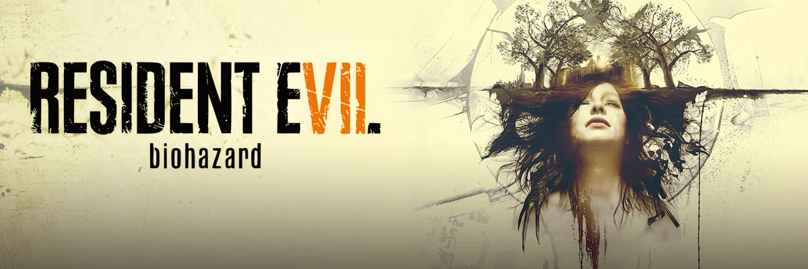
**Biohazard** es una máquina de nivel **Medio** en la plataforma **TryHackMe**, que me brindó un excelente desafío de CTF. En este write-up, documento el proceso que seguí para resolver la máquina, enfrentándome a una serie de retos inesperados que requirieron un profundo **análisis de cifrados** y la aplicación de técnicas de **esteganografía** y **decodificación de textos**. A lo largo de este análisis, detallaré cada paso, desde la fase inicial de reconocimiento hasta la obtención del acceso final.

---

## 📊 Datos Esenciales

- **IP de la Máquina:** `10.10.X.X`
- **Sistema Operativo:** `Linux`
- **Temática:** `Survival Horror`
- **Habilidades Clave:** `Análisis de Cifrados`, `Esteganografía`, `Vigenère`
- **Tiempo de Resolución:** `75 min`
---

## 🕵️‍♂️ Fase 1: Reconocimiento y Enumeración

El primer paso fue realizar un escaneo de puertos para identificar los servicios activos en la máquina. Utilicé `nmap` con los siguientes parámetros para un escaneo de versiones y scripts:

```bash
nmap -p- --open -sS -sC -sV --min-rate 2000 -vvv -n -Pn 10.10.248.135 -oN escaneo
```

El escaneo inicial con **Nmap** confirmó que la máquina está en línea y reveló los siguientes puertos abiertos:

---

### Puertos Abiertos

  * **Puerto 21 (FTP)**
      * **Servicio:** vsftpd 3.0.3
  * **Puerto 22 (SSH)**
      * **Servicio:** OpenSSH 7.6p1 Ubuntu
  * **Puerto 80 (HTTP)**
      * **Servicio:** Apache httpd 2.4.29 (Ubuntu)
      * **Título del sitio:** "Beginning of the end"

---
### Análisis del Sitio Web (Puerto 80)
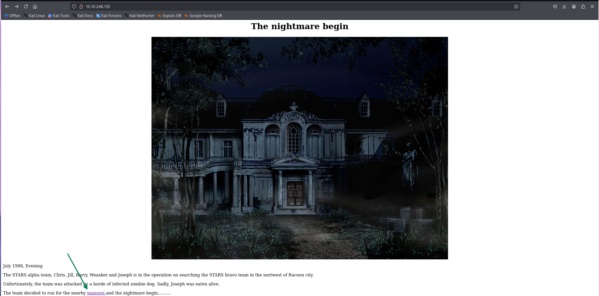

Dentro del código fuente de http://10.10.248.135/mansionmain/ encontramos el siguiente directorio

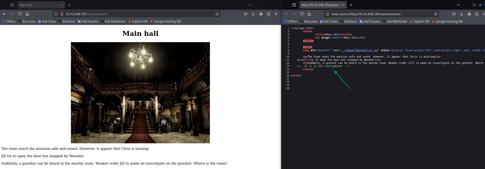
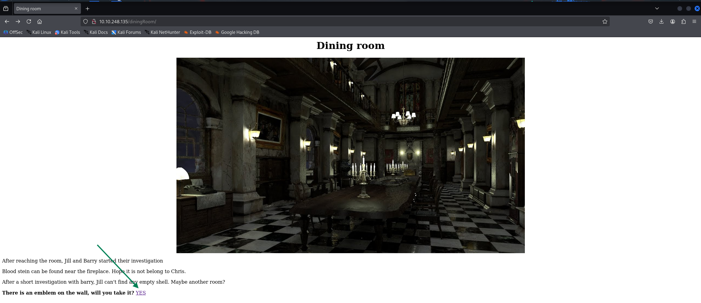

Encontramos nuestra primera flag `emblem{fec832623ea498e20bf4fe1821d58727}`

Volvemos a http://10.10.248.135/diningRoom/ e inspecionamos su codigo fuente
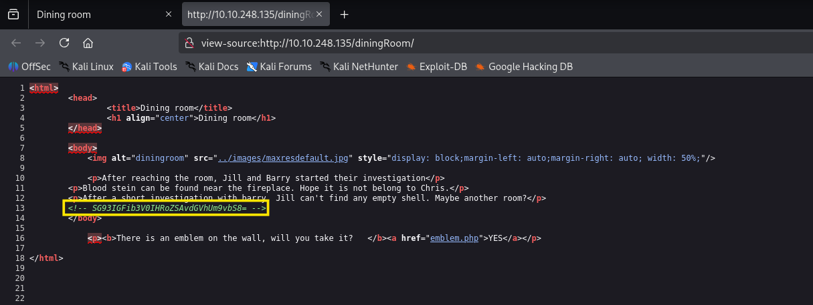

Obtenemos una cadena codificada en base64 y para decodificarlo ejectuamos el comando:
```
echo "SG93IGFib3V0IHRoZSAvdGVhUm9vbS8=" | base64 -d
```
 El cual nos revela un nuevo directorio `/teaRoom/`

 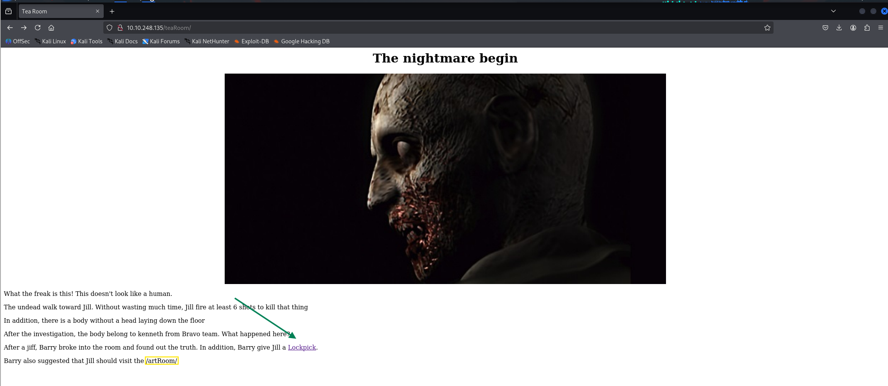
¡
Vemos reflejado otro nuevo directorio, además, al hacer click en `Lockpick` encontramos la bandera: `lock_pick{037b35e2ff90916a9abf99129c8e1837}`

 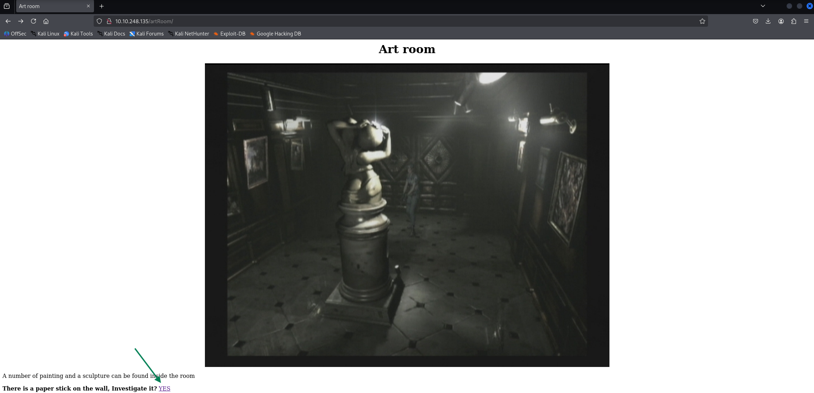

 Al hacer click en yes, nos dirige a una página la cual nos revela una multitud de nuevos direcorios a inspecionar

 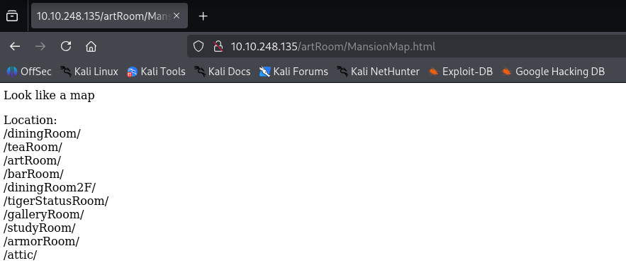

 Nos vamos a `/barRoom/` a seguir con la enumeración.
 
 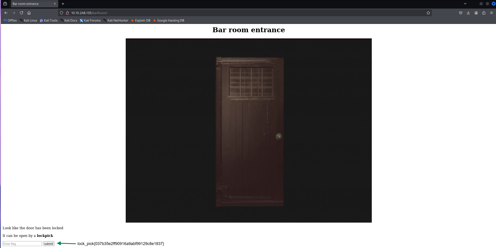
  
   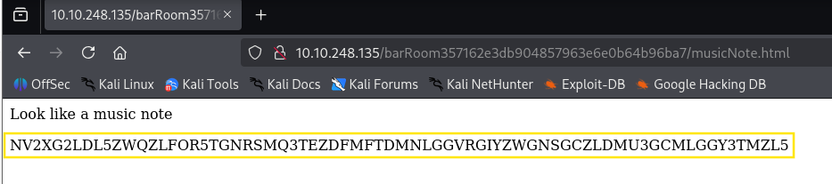
   Obtenemos una cadena codificada en base 32 y para decodificarlo ejectuamos el comando:
   ```
   echo "NV2XG2LDL5ZWQZLFOR5TGNRSMQ3TEZDFMFTDMNLGGVRGIYZWGNSGCZLDMU3GCMLGGY3TMZL5" | base32 -d
   ```
El cual nos revela una nueva flag `music_sheet{362d72deaf65f5bdc63daece6a1f676e}`

 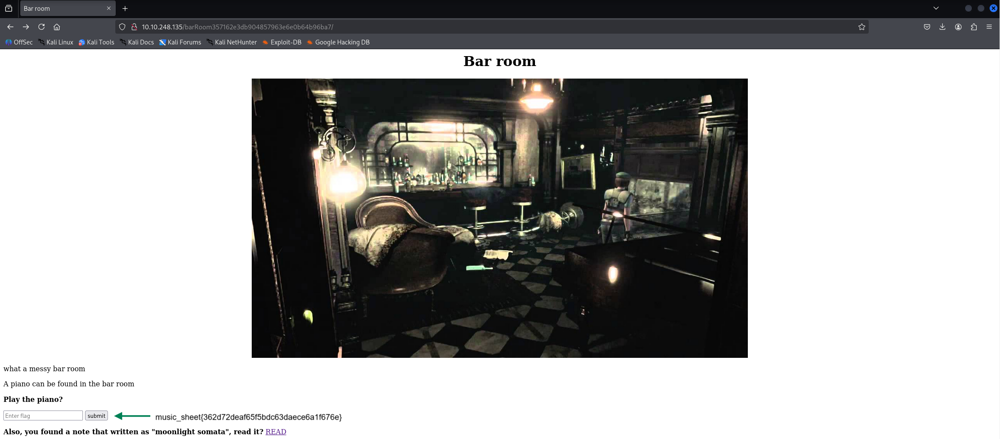
  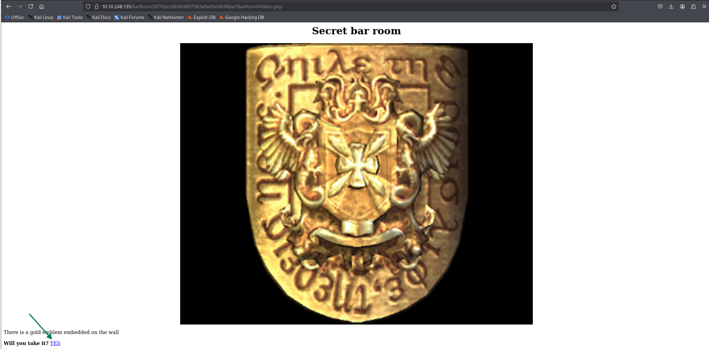
   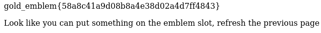
   Conseguimos otra flag `gold_emblem{58a8c41a9d08b8a4e38d02a4d7ff4843}` pero además hay un mensaje que dice: 
`Parece que puedes poner algo en la ranura del emblema, actualiza la página anterior.`
Seguimos las indicaciones del mensaje.

  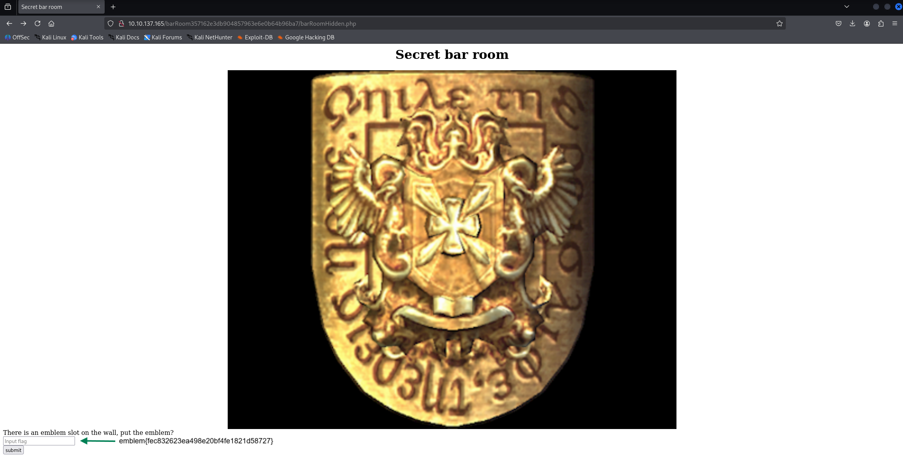
Nos redirige a una página con el nombre "rebecca".
Vamos ahora al directorio /diningRoom/
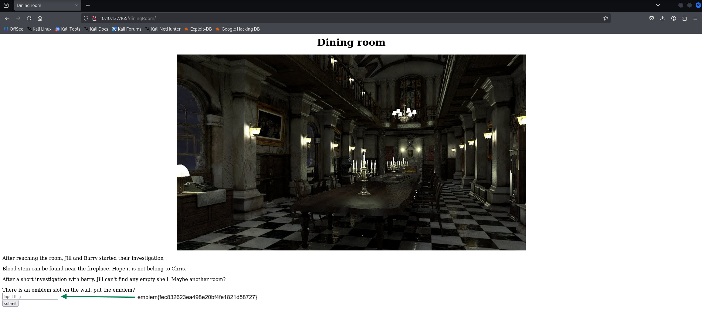
